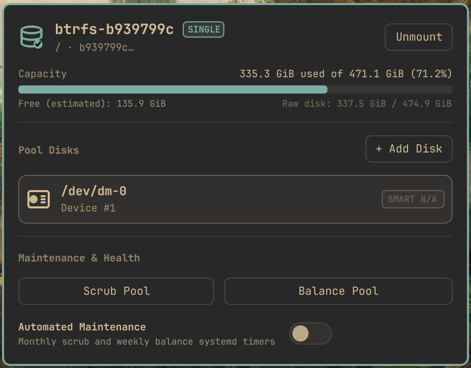

# Btrfs RAID Manager — Omarchy bar widget

Inspect, mount, and manage Btrfs RAID1 pools from the bar.



A resident Go companion streams state as NDJSON. It listens to D-Bus signals (`UDisks2`, `systemd`) and reads `/sys/fs/btrfs/`. No polling.

## Install

```sh
omarchy plugin add https://github.com/franelfers/omarchy-btrfs-raid-manager.git --enable
omarchy bar move io.github.franelfers.btrfs-raid-manager --section right
omarchy restart shell
```

For local development:

```sh
git clone https://github.com/franelfers/omarchy-btrfs-raid-manager.git
cd omarchy-btrfs-raid-manager
./install.sh --link --enable
```

## Requirements

- `omarchy-shell` (Quickshell runtime)
- `btrfs-progs`
- `smartmontools` _(optional, for SMART data; shows `N/A` without it)_

## Optional setup

Mount and unmount use the standard UDisks2 Polkit rules. No setup needed.

Install the bundled Polkit policy to allow `device add/remove/replace`:

```sh
sudo cp polkit/org.omarchy.btrfs.raidmanager.policy /usr/share/polkit-1/actions/
```

Install the systemd units to allow scheduled scrub and balance:

```sh
sudo cp systemd/btrpool-* /etc/systemd/system/
sudo systemctl daemon-reload
```

## Usage

Click the bar glyph to open the flyout.

- **Glyph** — pool health and used percentage. Accent when healthy, pulsing during scrub or balance, urgent on a degraded pool or SMART errors.
- **Flyout**
  - Capacity gauge (used vs. estimated free) and mount/unmount toggle.
  - Disks with device node, model, and SMART health badge.
  - Start or cancel scrub and balance.
  - Toggle the scheduled maintenance timers.

## Data sources

| Source                     | Provides                                      |
| -------------------------- | --------------------------------------------- |
| `/sys/fs/btrfs/<uuid>/`    | Capacity, devices, RAID profile               |
| `org.freedesktop.UDisks2`  | Mount state, block devices, drive attachment  |
| `btrfs --format=json`      | Scrub and balance progress                    |
| `smartctl`                 | Temperature and SMART attributes              |
| `org.freedesktop.systemd1` | Scrub/balance unit state and timer schedules  |

## Verify

```sh
qmllint qml/**/*.qml
systemd-analyze verify systemd/*
go test -v -race ./...
omarchy plugin validate .
```

## License

GPL-3.0 — see [LICENSE](LICENSE).
